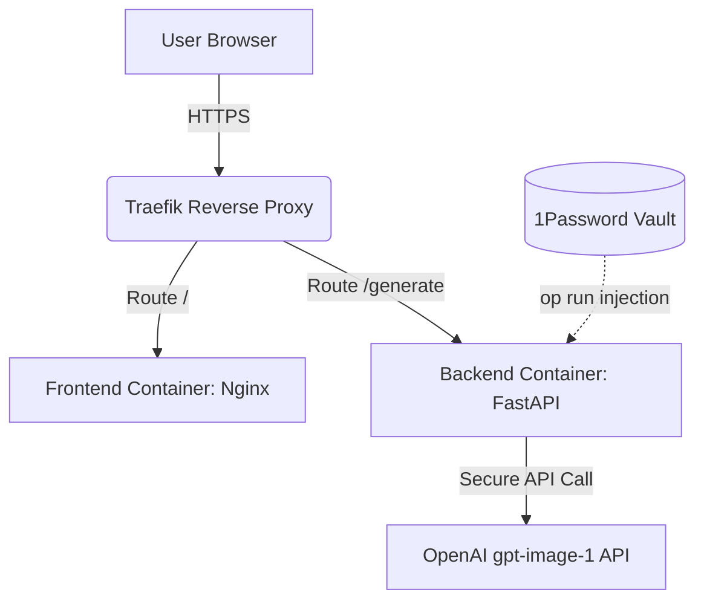

# 🌌 Lumina Art

[](https://platform.openai.com/docs/models/gpt-image-1)
[](https://fastapi.tiangolo.com/)
[](https://reactjs.org/)
[](https://www.docker.com/)
[](https://1password.com/)

**Lumina Art** is a small, focused demo of a secure server-side proxy for OpenAI's `gpt-image-1` image generation model (the April 2025 successor to DALL-E 3). The React frontend sends a prompt to a FastAPI backend, which holds the API key and is the only thing that talks to OpenAI — the key never reaches the browser.

🔗 **Live Demo:** [https://lumina.willianpinho.com](https://lumina.willianpinho.com)

---

## 🛠 What This Demonstrates

This is a single-endpoint proxy, not a full product — but the pattern is one worth getting right:

### 1. **Secure Credential Handling**

- **Secure Proxy Pattern:** The React frontend never communicates directly with OpenAI. A FastAPI backend acts as a secure proxy, keeping the API key server-side and never exposing it to the browser.
- **1Password CLI for local dev:** Injects the API key into the environment at runtime via `op run`, so it never sits in a plaintext `.env` on disk (optional, recommended workflow — see Setup below).

### 2. **Deployment**

- **Containerization:** Dockerized with a multi-stage build for the frontend (served via Nginx) and a lightweight Python backend container.
- **TLS via Traefik:** Deployed behind Traefik with automatic Let's Encrypt certificate management.

### 3. **UI**

- **Glassmorphism Aesthetic:** A dark-mode interface with translucent layers, backdrop filters, and gradients.
- Built with **Vite** and **React**.

---

## 🏗 Tech Stack

- **Frontend:** React 18, TypeScript, Vite, Vanilla CSS (Custom Glassmorphism).
- **Backend:** Python 3.11, FastAPI, Pydantic, OpenAI SDK.
- **Infrastructure:** Docker, Docker Compose, Traefik, Nginx.
- **Tooling:** 1Password CLI, GitHub CLI, SSH.

---

## 🚀 Local Development

### Prerequisites

- Python 3.11+
- Node.js 18+
- 1Password CLI (optional, but recommended)

### Setup

1. **Clone & Install:**

   ```bash
   git clone https://github.com/willianpinho/lumina-art.git
   cd lumina-art
   ```

2. **Backend:**

   ```bash
   cd backend
   pip install -r requirements.txt
   # Run with 1Password:
   op run --env-file=.env -- uvicorn main:app --reload
   ```

3. **Frontend:**
   ```bash
   cd frontend
   npm install
   npm run dev
   ```

### Running Tests

```bash
cd backend
pip install -r requirements-dev.txt
pytest -v
```

---

## Scope

This is a ~200-line, single-endpoint proxy — not a full product. No queue, rate
limiting, persistence, or auth; the backend has unit tests covering input
validation and the OpenAI call (mocked), the frontend does not yet. Deliberately
small: proxying the API key is the entire job.

---

## 📐 Architecture Overview



---

Built with ⚡ by [Willian Pinho](https://willianpinho.com)
