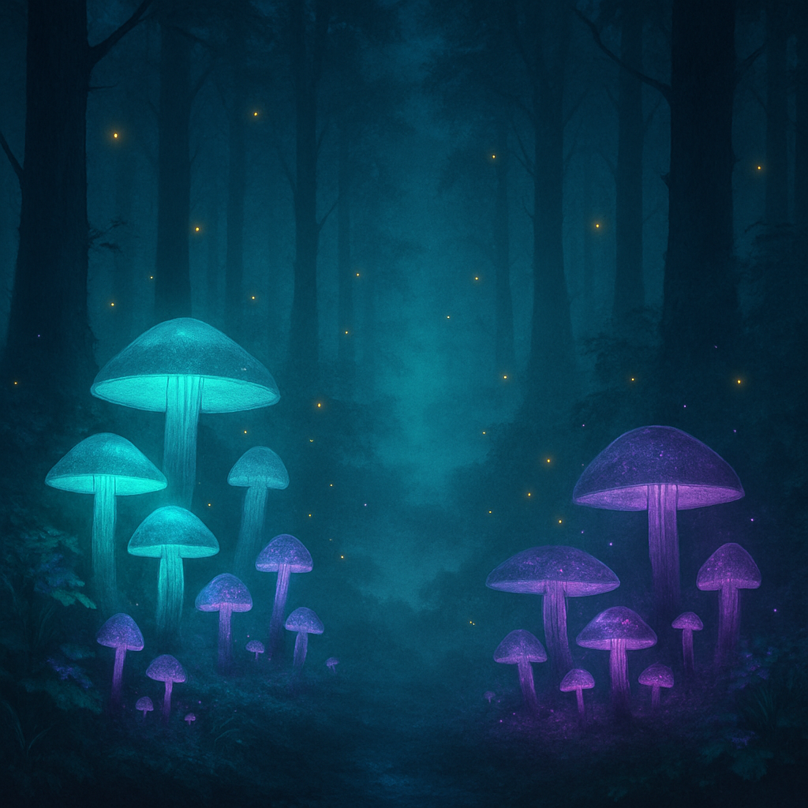
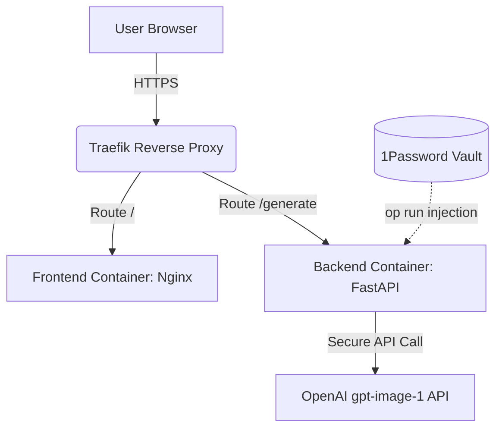

# 🌌 Lumina Art: AI-Powered Masterpiece Generator

[](https://platform.openai.com/docs/models/gpt-image-1)
[](https://fastapi.tiangolo.com/)
[](https://reactjs.org/)
[](https://www.docker.com/)
[](https://1password.com/)

**Lumina Art** is a high-performance, full-stack application designed to transform creative prompts into stunning visual art using OpenAI's `gpt-image-1` model (the April 2025 successor to DALL-E 3). Built with a focus on modern engineering standards, security, and seamless deployment.

🔗 **Live Demo:** [https://lumina.willianpinho.com](https://lumina.willianpinho.com)

## ✨ Example Output



> **Prompt:** _"A serene bioluminescent forest at night, glowing mushrooms and fireflies, ethereal mist, digital art, vibrant teal and purple palette"_ — rendered by `gpt-image-1` at 1024×1024.

---

## 🛠 Engineering Excellence

This project was built to demonstrate more than just AI integration; it showcases a robust production-ready architecture:

### 1. **Security-First Credential Management**

- **1Password Integration:** Utilizes the 1Password CLI (`op`) to inject API keys into the environment at runtime, ensuring that sensitive credentials never touch the disk in plain text.
- **Secure Proxy Pattern:** The React frontend never communicates directly with OpenAI. A FastAPI backend acts as a secure proxy, keeping the API key server-side and never exposing it to the browser.

### 2. **Advanced DevOps & Infrastructure**

- **Containerization:** Fully Dockerized with a multi-stage build process for optimized frontend delivery via Nginx and a lightweight Python backend.
- **Cloud Native Orchestration:** Integrated with **Traefik** for automated SSL/TLS certificate management (Let's Encrypt) and high-performance load balancing.
- **Zero-Exposure Deployment:** Automated shell scripts for secure deployment to Hetzner VPS, handling key injection and service updates via SSH pipes.

### 3. **Modern UX/UI Design**

- **Glassmorphism Aesthetic:** A sophisticated dark-mode interface featuring translucid layers, backdrop filters, and vibrant gradients.
- **Responsive Performance:** Built with **Vite** and **React** for lightning-fast interactivity and optimized asset loading.

---

## 🏗 Tech Stack

- **Frontend:** React 18, TypeScript, Vite, Vanilla CSS (Custom Glassmorphism).
- **Backend:** Python 3.11, FastAPI, Pydantic, OpenAI SDK.
- **Infrastructure:** Docker, Docker Compose, Traefik, Nginx.
- **Tooling:** 1Password CLI, GitHub CLI, SSH.

---

## 🚀 Local Development

### Prerequisites

- Python 3.11+
- Node.js 18+
- 1Password CLI (optional, but recommended)

### Setup

1. **Clone & Install:**

   ```bash
   git clone https://github.com/willianpinho/lumina-art.git
   cd lumina-art
   ```

2. **Backend:**

   ```bash
   cd backend
   pip install -r requirements.txt
   # Run with 1Password:
   op run --env-file=.env -- uvicorn main:app --reload
   ```

3. **Frontend:**
   ```bash
   cd frontend
   npm install
   npm run dev
   ```

---

## 📐 Architecture Overview



---

Built with ⚡ by [Willian Pinho](https://willianpinho.com)
